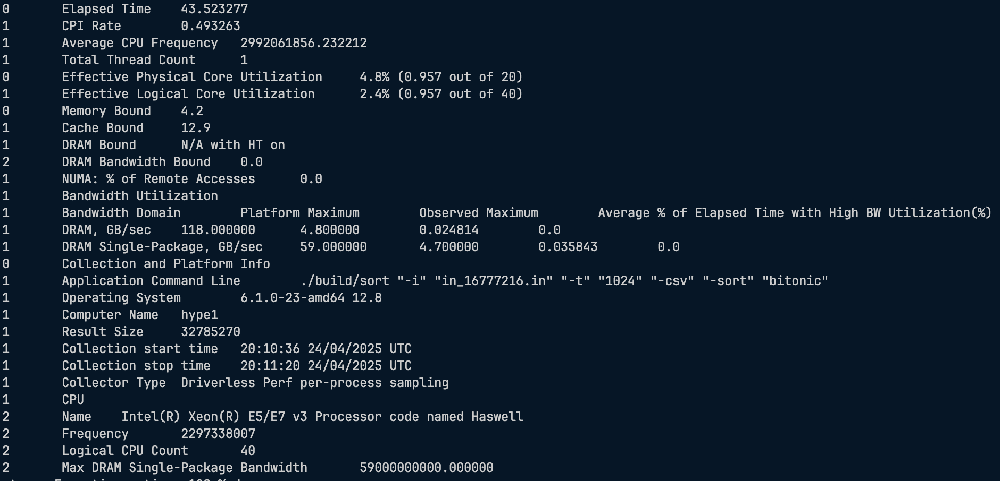
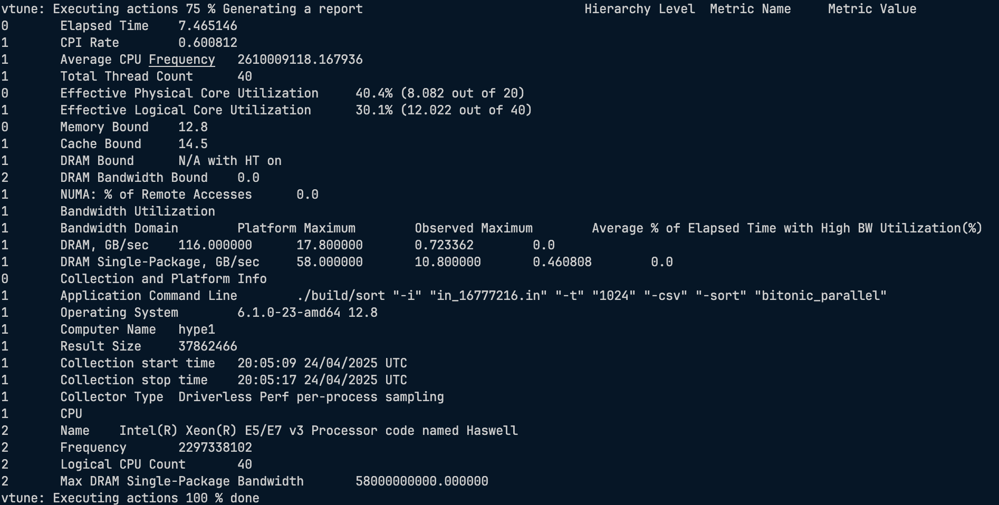
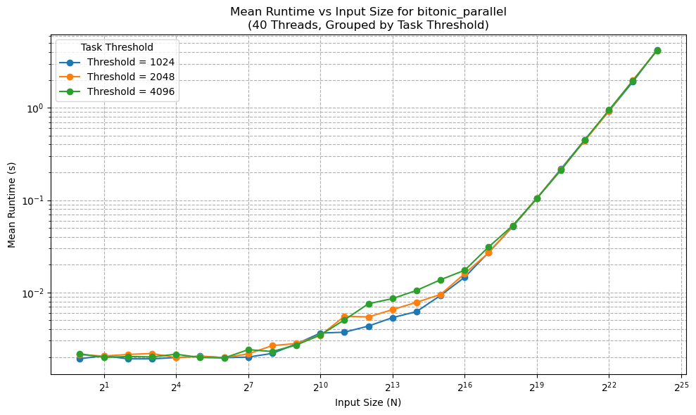
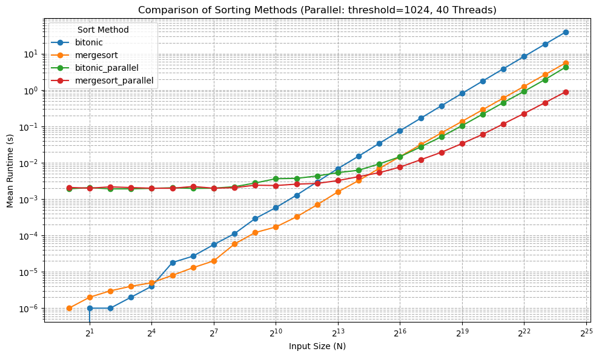
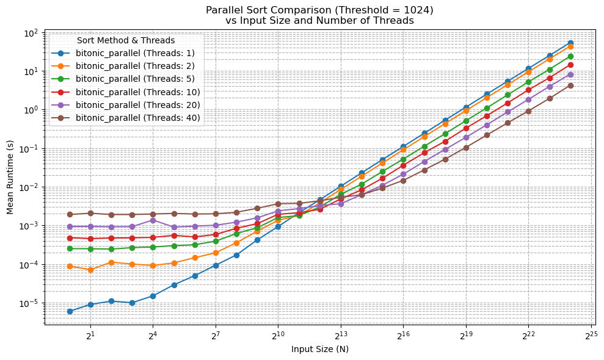
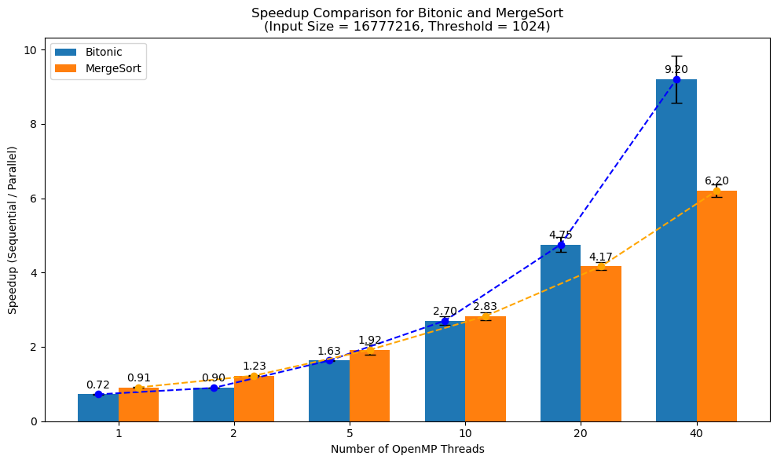

# **Análise de Performance do Bitonic Sort**

### **Henrique Utzig & Pedro Afonso Klein**

---

## **O Objetivo do Trabalho**

* **Problema:** Avaliar e paralelizar o algoritmo **Bitonic Sort**.
* **Ferramenta:** Utilizar a biblioteca **OpenMP** para a implementação paralela.
* **Análise:**
    1.  Executar uma série de testes sistemáticos.
    2.  Comparar o desempenho da versão sequencial vs. paralela.
    3.  Analisar escalabilidade, overhead e ganhos de performance.

---

## **O que é o Bitonic Sort?**

É um algoritmo de ordenação com alta aptidão para paralelismo.

1.  **Dividir e Conquistar:** O vetor é dividido recursivamente.
2.  **Criar Sequências Bitônicas:** Metade do sub-vetor é ordenada de forma crescente e a outra metade, decrescente. Isso cria uma sequência "bitônica" (que primeiro sobe, depois desce).
3.  **Merge Bitônico:** Uma etapa de fusão especial e altamente paralelizável transforma a sequência bitônica em um vetor totalmente ordenado.

---

## **Por que ele é bom para Paralelismo?**

Sua estrutura é **regular e previsível**.

* **Operações Independentes:** Em cada passo, múltiplos pares de elementos podem ser comparados e trocados ao mesmo tempo, sem que um interfira no outro.
* **Recursão Paralelizável:** As chamadas recursivas, tanto para criar as sequências quanto para fazer o merge, são tarefas independentes e ideais para serem distribuídas entre threads.

---

## **Implementação Paralela com OpenMP**

Utilizamos o paralelismo de **tarefas** do OpenMP.

* **Estratégia:** Transformar as chamadas recursivas em tarefas independentes.
* **Diretivas Chave:**
    * `#pragma omp parallel`: Cria a equipe de threads.
    * `#pragma omp single`: Garante que apenas uma thread inicialize as tarefas.
    * `#pragma omp task`: Delega uma chamada de função para ser executada por uma thread livre.
* **Controle de Overhead:** Usamos um `task_threshold` para evitar criar tarefas para sub-vetores muito pequenos, o que degradaria a performance.

---

## **Metodologia de Testes**

Uma abordagem sistemática para obter resultados confiáveis.

* **Algoritmos Comparados:**
    * Bitonic Sort (Sequencial e Paralelo)
    * Merge Sort (Sequencial e Paralelo) -> *usado como **referência** de desempenho.*
* **Automação:** Um script em Python gerenciou todo o processo:
    * Execução dos testes com diferentes parâmetros.
    * Coleta dos resultados em arquivos CSV.
    * Validação da correção da saída ordenada.

---

## **Análise de Performance: VTune**

Uma análise "de baixo nível" com o Intel VTune Profiler ($N \approx 16.7$ milhões).

### Sequencial

* **Tempo:** ~43,5 s
* **CPI:** 0.49 (Bom)
* **Uso Efetivo de CPU:** 4,8%
* **Pressão na Memória:** Baixa

### Paralelo (40 threads)

* **Tempo:** **~7,5 s** (~5.8x mais rápido)
* **CPI:** 0.60 (Maior overhead)
* **Uso Efetivo de CPU:** 40,4% (~8 núcleos)
* **Pressão na Memória:** Maior

---

## **Análise de Performance: VTune**

Uma análise "de baixo nível" com o Intel VTune Profiler ($N \approx 16.7$ milhões).

### Sequencial

* **Tempo:** ~43,5 s
* **CPI:** 0.49 (Bom)
* **Uso Efetivo de CPU:** 4,8%
* **Pressão na Memória:** Baixa

<!--  -->

### Paralelo (40 threads)

* **Tempo:** **~7,5 s** (~5.8x mais rápido)
* **CPI:** 0.60 (Maior overhead)
* **Uso Efetivo de CPU:** 40,4% (~8 núcleos)
* **Pressão na Memória:** Maior

<!--  -->

**Conclusão:** O paralelismo traz um ganho de velocidade expressivo, mas com o custo de maior overhead (CPI) e maior disputa por recursos (memória/cache).

---

## **Resultados: Impacto do `task_threshold`**

O `threshold` de 1024 apresentou uma ligeira vantagem para entradas maiores, mas o ganho se estabiliza. O ponto ótimo de granularidade depende do tamanho da entrada.

  

---

## **Resultados: Comparação dos Algoritmos**

* **Entradas Pequenas:** Versões sequenciais vencem devido ao baixo overhead.
* **Entradas Grandes:** O paralelismo domina.
* **Vencedor:** O **Merge Sort Paralelo se mostrou mais rápido** que o Bitonic Sort Paralelo para a maioria das entradas testadas.

---
## **Resultados: Comparação dos Algoritmos**

  

---

## **Resultados: Escalabilidade com Threads**

O desempenho melhora com mais threads, mas **apenas para entradas grandes**. Para entradas pequenas, o excesso de threads e tarefas gera tanto overhead que o desempenho piora.

___
## **Resultados: Escalabilidade com Threads**

  

---

## **Resultados: Comparativo de Speedup**

* **Merge Sort:** Apresentou menor variabilidade e bom speedup.
* **Bitonic Sort:** Demonstrou uma **tendência de escalar melhor** com um número muito alto de threads.

Isso sinaliza o potencial do Bitonic Sort em arquiteturas massivamente paralelas (como GPUs).

---
## **Resultados: Comparativo de Speedup**

  

---

## **Conclusões Finais**

1.  **Paralelismo Funciona:** A implementação com OpenMP trouxe um ganho de performance expressivo (speedup de até 9.2x).

2.  **Overhead é o Critico:** O `task_threshold` é um parâmetro crítico para controlar o custo da criação de tarefas. O valor 1024 se mostrou um bom equilíbrio.

3.  **O Melhor Algoritmo Depende:** Para uma CPU multi-core, o **Merge Sort Paralelo foi mais eficiente** na prática.

4.  **Potencial do Bitonic:** A estrutura do Bitonic Sort sugere um **potencial de escalabilidade superior** em hardware com centenas ou milhares de núcleos (GPUs, FPGAs).

---

## **Possiveis Melhorias**

* **Threshold Adaptativo:** Criar um `task_threshold` que se ajusta dinamicamente ao tamanho do problema.
* **Otimização de Memória:** Explorar afinidade de threads (afinidade NUMA) para reduzir a latência de acesso à memória.
* **Melhorar Localidade de Dados:** Otimizar o código para minimizar *cache misses*.
* **Modelos Híbridos:** Avaliar o uso de `task` combinado com `parallel for` ou até mesmo descarregar parte do trabalho para uma GPU.